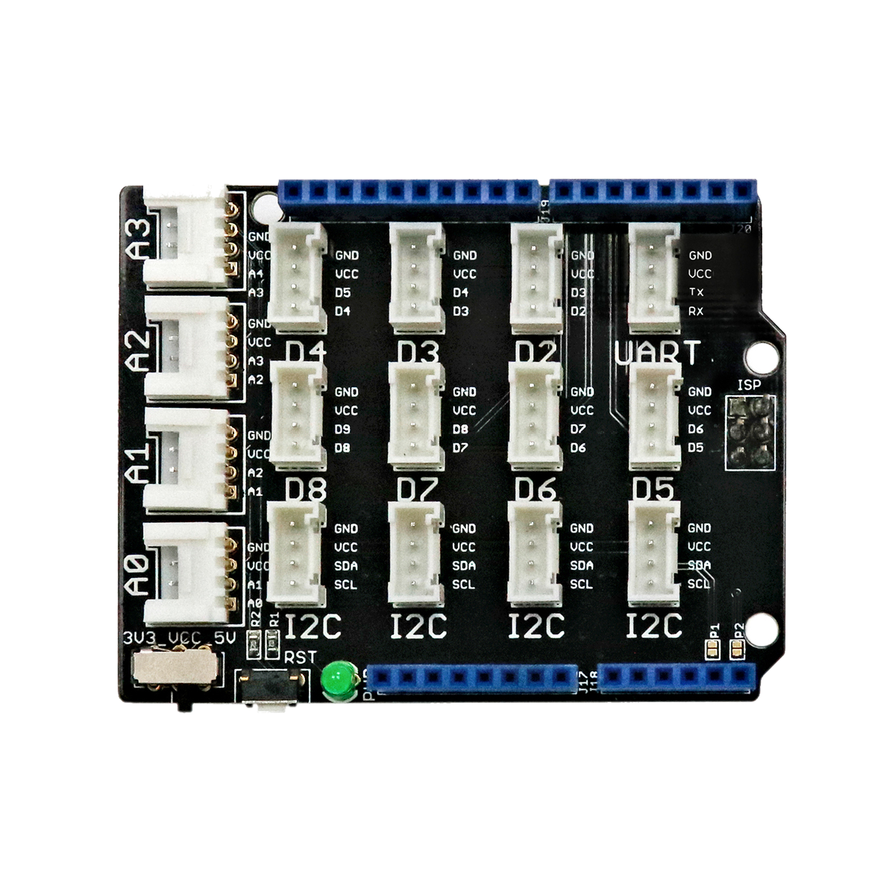

# Grove Shield (Arduino)

## Beschreibung
Das Grove Base Shield ist eine Erweiterungsplatine für Arduino-ähnliche Mikrocontroller. Diese Erweiterungsplatinen werden im Allgemeinen als „Shield“ bezeichnet. Sie werden auf den entsprechenden Controller oder Einplatinencomputer gesteckt und vereinfachen das Anschließen von speziellen Komponenten.

Das abgebildete Shield ist speziell für alle Arduino-ähnlichen Controller entwickelt. Das Shield stellt alle wichtigen Anschlüsse des Mikrocontrollers auf vereinfachten Steckplätzen zur Verfügung, sodass alle weiteren Komponenten über standardisierte Steckkabel angeschlossen werden können (ohne zu löten). Das Shield stellt so digitale und analoge Anschlüsse sowie die seriellen Anschlüsse I2C und SPI in komfortablen Steckplätzen bereit.

Alle weiteren Hintergrundinformationen sowie ein Beispielaufbau und alle notwendigen Programmbibliotheken sind auf dem offiziellen Wiki (bisher nur in englischer Sprache) von Seeed Studio zusammengefasst. Zusätzlich findet man über alle gängigen Suchmaschinen durch die Eingabe der genauen Komponentenbezeichnung entsprechende Projektbeispiele und Tutorials.

**Wichtige Hinweise:**

Auf dem Grove Shield befindet sich direkt neben dem Reset-Taster ein kleiner Schalter, mit dem zwischen 5V und 3,3V Boardspannung gewechselt werden kann. Wird das Grove Shield mit einem Arduino UNO verwendet, muss **dieser Schalter immer auf 5V gestellt werden**. Andernfalls kann es passieren, dass angeschlossene Sensoren und Aktoren nicht ordnungsgemäß funktionieren.

 

## Beispiele

!!!show-examples:./examples/

<!-- infolist -->

## Wichtige Links für die ersten Schritte:

- [Seeed Studio Wiki](http://wiki.seeedstudio.com/Base_Shield_V2/) [- Grove Shield](http://wiki.seeedstudio.com/Base_Shield_V2/)
- [EXP-Tech Wiki - Grove System](https://www.exp-tech.de/seeed-grove-wiki)

## Projektbeispiele:

- [EXP-Tech - LCD Panel](https://www.exp-tech.de/blog/seeed-studio-grove-lcd-projekt)

## Weiterführende Hintergrundinformationen:

- [Einplatinencomputer - Wikipedia Artikel](https://de.wikipedia.org/wiki/Einplatinencomputer)
- [Mikrocontroller - Wikipedia Artikel](https://de.wikipedia.org/wiki/Mikrocontroller)
- [Arduino.cc - Liste von Shields](http://playground.arduino.cc/Main/SimilarBoards#goShie)
- [GPIO - Wikipedia Artikel](https://de.wikipedia.org/wiki/Allzweckeingabe/-ausgabe)
- [I2C - Wikipedia Artikel](https://de.wikipedia.org/wiki/I%C2%B2C)
- [SPI - Wikipedia Artikel](https://de.wikipedia.org/wiki/Serial_Peripheral_Interface)
- [UART - Wikipedia Artikel](https://de.wikipedia.org/wiki/Universal_Asynchronous_Receiver_Transmitter)

