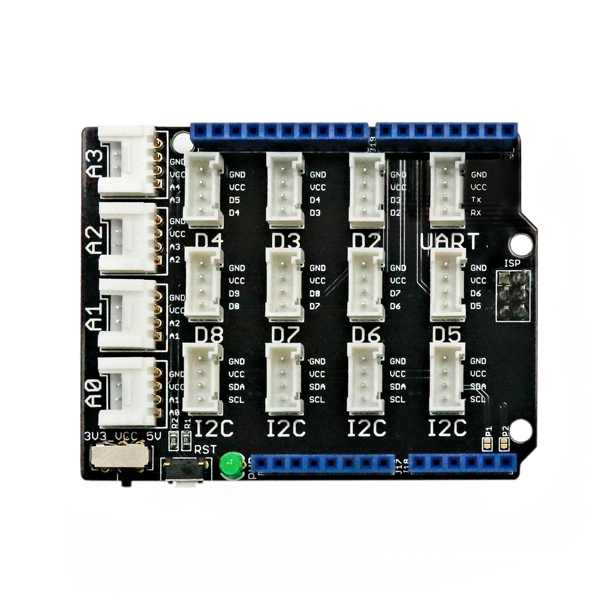

---
title: "Grove Shield (Arduino)"
date: "2018-08-28T23:43:51.000Z"
tags: 
  - "shield"
coverImage: "66_grove_shield_arduino.jpg"
material_number: "66"
material_type: "shield"
material_short_descr: "Seeed Studio Grove Base Shield v2"
manufacture: "Seeed Studio"
manufacture_url: "https://www.seeedstudio.com/"
repo_name: "mks-SeeedStudio-Grove_Base_Shield_V2"
repo_prefix: "mks"
repo_manufacture: "SeeedStudio"
repo_part: "Grove_Base_Shield_V2"
product_url: "https://wiki.seeedstudio.com/Base_Shield_V2/"
clone_url: "https://github.com/Make-Your-School/mks-SeeedStudio-Grove_Base_Shield_V2.git"
embedded_example_file: "examples/Grove_Base_Shield_V2_minimal/Grove_Base_Shield_V2_minimal.ino"
---

# Grove Shield (Arduino)

## Beschreibung
Das Grove Base Shield ist eine Erweiterungsplatine für Arduino-ähnliche Mikrocontroller. Diese Erweiterungsplatinen werden im Allgemeinen als „Shield“ bezeichnet. Sie werden auf den entsprechenden Controller oder Einplatinencomputer gesteckt und vereinfachen das Anschließen von speziellen Komponenten.

Das abgebildete Shield ist speziell für alle Arduino-ähnlichen Controller entwickelt. Das Shield stellt alle wichtigen Anschlüsse des Mikrocontrollers auf vereinfachten Steckplätzen zur Verfügung, sodass alle weiteren Komponenten über standardisierte Steckkabel angeschlossen werden können (ohne zu löten). Das Shield stellt so \[simple\_tooltip content='

Digital vs. analog:

- Analoge Signale können beliebige kontinuierliche Werte annehmen. Sie verändern sich stufenlos. Dadurch können theoretisch unendlich viele kleine Änderungen (und damit ein unendlicher Informationsinhalt) übertragen werden. Einschränkend wirkt die Genauigkeit, mit der das analoge Signal ausgelesen/erfasst wird.
- Das digitale Signal nimmt nur diskrete Werte an und springt bei einer etwaigen Änderung von einem Wert zum nächsten. Es kann nur eine definierte Anzahl an Informationsinhalten übertragen werden. Vorteilhaft ist dagegen die damit verbundene Fehlerfreiheit bei minimalsten, ungewollten Schwankungen. Oftmals werden nur zwei Werte HIGH und LOW (Ein/Aus oder 1/0) übermittelt.

'\]digitale und analoge\[/simple\_tooltip\] \[simple\_tooltip content='Die Mikrocontroller besitzen kleine metallische Kontakte, an die Komponenten, Shields oder andere Platinen angeschlossen werden können. Diese Kontakte werden Pins genannt und können oft als sogenannte GPIO’s (Allzweck Ein- und Ausgabe) eingesetzt werden. Dies bedeutet, dass diese Pins direkt über die Programmierung des Mikrocontrollers angesprochen werden können und hierbei sogar bestimmt werden kann, ob dieser Pin als Eingang (beispielsweise zum Auslesen eines Sensors) oder als Ausgang (beispielsweise zur Steuerung eines Motors) genutzt werden kann. Praktisches vereinfachtes Beispiel: Wird am Arduino eine LED an Pin 1 angeschlossen, kann im Programm direkt der Pin 1 als „An“ oder „Aus“ definiert werden und damit die LED an- oder ausgeschaltet werden. '\]Anschlüsse\[/simple\_tooltip\] sowie \[simple\_tooltip content='Bei einer seriellen Datenübertragung werden die Bits (Informationen/Kommandos) nacheinander (seriell) über eine Leitung übertragen. Die wichtigsten seriellen Standards im Rahmen der Mikrocontroller sind I2C (Inter-Integrated Circuit), SPI (Serial Peripheral Interface) und UART (Universal Asynchronous Receiver Transmitter). Die genaue Funktionsweise ist für die reine Nutzung vorerst irrelevant. Es muss allerdings immer geprüft werden an welchen Pins oder an welchen Steckplätzen der jeweilige serielle Anschluss genutzt werden kann. Dies wird in den Datenblättern der Mikrocontroller normalerweise mit angegeben.'\]die seriellen Anschlüsse I2C und SPI\[/simple\_tooltip\] in komfortablen Steckplätzen bereit.

Alle weiteren Hintergrundinformationen sowie ein Beispielaufbau und alle notwendigen Programmbibliotheken sind auf dem offiziellen Wiki (bisher nur in englischer Sprache) von Seeed Studio zusammengefasst. Zusätzlich findet man über alle gängigen Suchmaschinen durch die Eingabe der genauen Komponentenbezeichnung entsprechende Projektbeispiele und Tutorials.

**Wichtige Hinweise:**

Auf dem Grove Shield befindet sich direkt neben dem Reset-Taster ein kleiner Schalter, mit dem zwischen 5V und 3,3V Boardspannung gewechselt werden kann. Wird das Grove Shield mit einem Arduino UNO verwendet, muss **dieser Schalter immer auf 5V gestellt werden**. Andernfalls kann es passieren, dass angeschlossene Sensoren und Aktoren nicht ordnungsgemäß funktionieren.

 

<!-- infolist -->

## Wichtige Links für die ersten Schritte:

- [Seeed Studio Wiki](http://wiki.seeedstudio.com/Base_Shield_V2/) [- Grove Shield](http://wiki.seeedstudio.com/Base_Shield_V2/)
- [EXP-Tech Wiki - Grove System](https://www.exp-tech.de/seeed-grove-wiki)

## Projektbeispiele:

- [EXP-Tech - LCD Panel](https://www.exp-tech.de/blog/seeed-studio-grove-lcd-projekt)

## Weiterführende Hintergrundinformationen:

- [Einplatinencomputer - Wikipedia Artikel](https://de.wikipedia.org/wiki/Einplatinencomputer)
- [Mikrocontroller - Wikipedia Artikel](https://de.wikipedia.org/wiki/Mikrocontroller)
- [Arduino.cc - Liste von Shields](http://playground.arduino.cc/Main/SimilarBoards#goShie)
- [GPIO - Wikipedia Artikel](https://de.wikipedia.org/wiki/Allzweckeingabe/-ausgabe)
- [I2C - Wikipedia Artikel](https://de.wikipedia.org/wiki/I%C2%B2C)
- [SPI - Wikipedia Artikel](https://de.wikipedia.org/wiki/Serial_Peripheral_Interface)
- [UART - Wikipedia Artikel](https://de.wikipedia.org/wiki/Universal_Asynchronous_Receiver_Transmitter)

